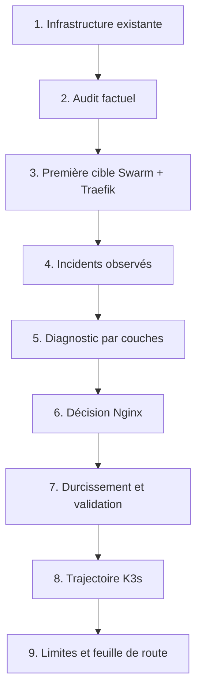

# Plan de soutenance — 20 minutes

Objectif : parler environ **17 min 30 à 18 min 30**. La marge restante absorbe les respirations, le changement de slide et une interruption courte.

## Chronométrage

| Temps | Partie | Message essentiel |
|---:|---|---|
| 0:00–0:45 | Accroche | Ce projet n'est pas un simple déplacement de conteneurs : c'est une stabilisation de bout en bout. |
| 0:45–2:00 | Contexte | Plusieurs services partagent un VPS contraint ; disponibilité et reprise sont des enjeux concrets. |
| 2:00–3:15 | Audit et VPS | Le fournisseur est choisi avec une grille de décision, pas uniquement avec le prix. |
| 3:15–5:30 | Swarm + Traefik | État désiré, découverte par labels, overlay, secrets et limites du mono-nœud. |
| 5:30–7:30 | Incidents | Diagnostic vertical DNS → TCP → TLS → edge → overlay → application. |
| 7:30–9:00 | Décision | Nginx est choisi pour l'explicitation et la facilité de revue, pas parce que Traefik serait mauvais. |
| 9:00–12:00 | Nginx + TLS | Host allowlist, DNS Docker, snippets, Certbot, Docker Configs versionnées et rollback. |
| 12:00–14:00 | Sécurité + backup | Moindre privilège, secrets runtime, exposition minimale, RPO/RTO et restauration. |
| 14:00–16:45 | K3s + observabilité | Namespaces, policies, Ingress, Restic, Prometheus, Loki et Alloy ; limites du laboratoire. |
| 16:45–18:30 | Résultats | Ce qui a été amélioré, ce qui reste à faire et pourquoi la démarche est crédible. |
| 18:30–19:20 | Compétences | Diagnostic, automatisation, sécurité et communication opérationnelle. |
| 19:20–20:00 | Conclusion | Une architecture professionnelle est compréhensible, vérifiable et récupérable. |

## Fil narratif

Le diagramme doit être lu verticalement. Chaque bloc répond à la question créée par le bloc précédent.

## Répartition des slides

1. Titre et promesse.
2. Contexte et problématique.
3. Méthode et chronologie.
4. Architecture Swarm + Traefik.
5. Incident et diagnostic.
6. Arbitrage Traefik / Nginx.
7. Architecture Nginx.
8. Sécurité, secrets et sauvegardes.
9. Plateforme K3s.
10. Observabilité et validation.
11. Résultats, limites et feuille de route.
12. Conclusion.

## Règle de présentation

Pour chaque choix technique, utiliser quatre phrases :

1. **Contrainte** : « Le catalogue de routes était stable et l'équipe réduite. »
2. **Décision** : « J'ai choisi une configuration Nginx explicite. »
3. **Preuve** : « Le pipeline vérifie la parité des domaines et exécute `nginx -t` dans l'image épinglée. »
4. **Limite** : « Cela ajoute un cycle Certbot séparé et centralise la configuration. »

Cette structure fait apparaître un raisonnement d'ingénierie, pas une préférence personnelle.

