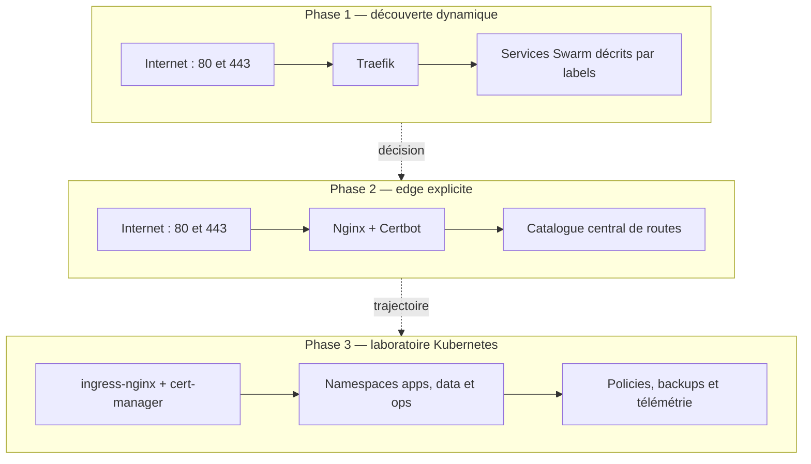
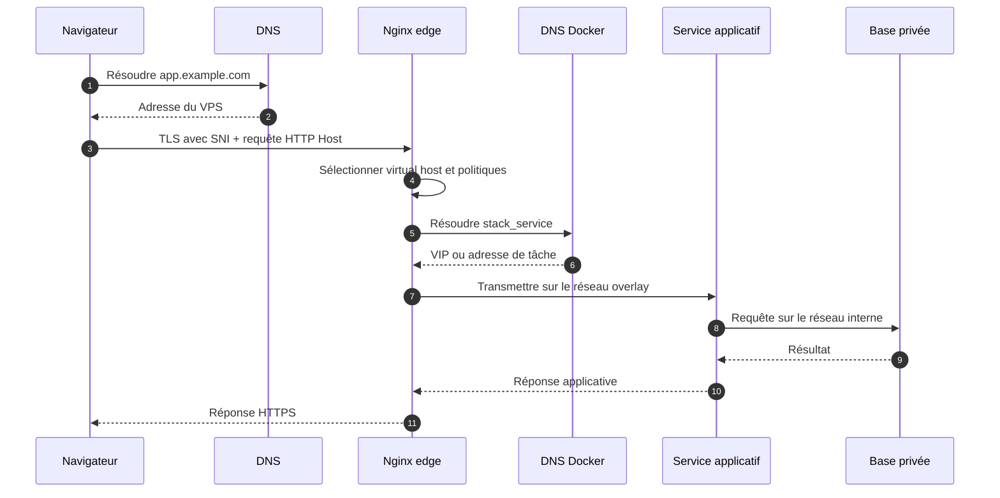
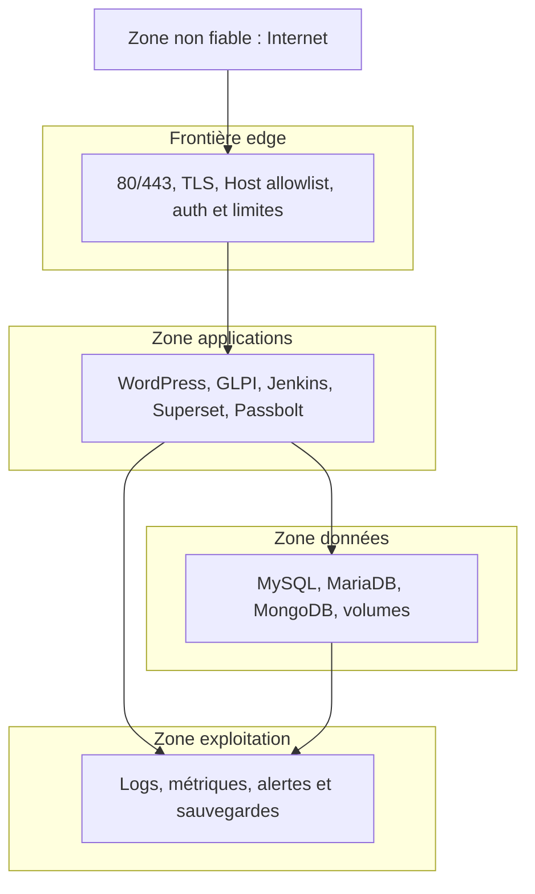

# Architecture globale

## Les trois phases

Lecture :

- Traefik optimise la découverte de changements fréquents.
- Nginx optimise l'explicitation d'un catalogue stable.
- K3s prépare la standardisation et l'écosystème Kubernetes.

Il ne faut pas présenter ces phases comme « mauvais outil → bon outil → meilleur outil ». Chaque phase répond à une contrainte différente.

## Chemin d'une requête dans la cible Swarm

À expliquer :

1. Le DNS public mène au VPS.
2. Le SNI sert au choix du certificat ; le Host sert au routage HTTP.
3. Nginx ne contacte pas un port public de l'application.
4. Docker résout le nom interne du service.
5. La base reste derrière une deuxième frontière réseau.

## Frontières de confiance

Formulation orale :

> « Je ne raisonne pas uniquement par conteneur. Je raisonne par frontière de confiance : exposition publique, edge, applications, données et exploitation. »

## Pourquoi le diagramme reste simple

Un diagramme d'architecture ne doit pas afficher toutes les connexions possibles. Il doit répondre à une question : ici, **dans quel ordre une requête traverse-t-elle les frontières ?** Les ports et exceptions détaillés restent dans une matrice séparée.

