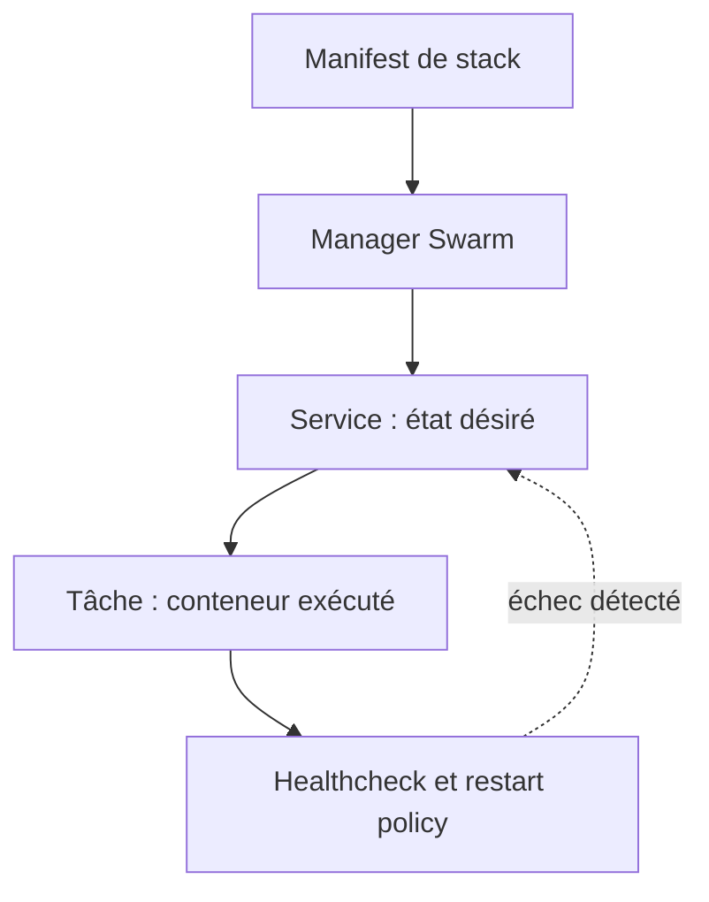
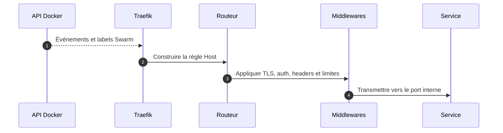

# Docker Swarm et Traefik

## Swarm en une phrase

Docker Swarm prend un **état désiré** et crée, remplace ou met à jour des tâches pour rapprocher l'état réel de cette déclaration.



## Les objets à connaître

| Objet | Explication claire | Erreur fréquente |
|---|---|---|
| Stack | Groupe de services déployé sous un préfixe commun. | Croire qu'une stack est un cluster. |
| Service | Déclaration durable : image, replicas, réseaux et politiques. | Le confondre avec un conteneur précis. |
| Task | Exécution d'un replica du service. | Dépendre de son adresse IP temporaire. |
| Overlay | Réseau virtuel reliant des services Swarm. | Publier un port alors qu'un réseau interne suffit. |
| Config | Fichier non secret et immuable distribué au service. | Réutiliser le même nom après modification. |
| Secret | Valeur sensible montée dans une tâche autorisée. | Supposer que l'application lit automatiquement le fichier. |
| Volume | Persistance indépendante du cycle du conteneur. | Confondre persistance locale et sauvegarde. |

## Ce qu'un Swarm mono-nœud apporte

- Déploiement déclaratif.
- Redémarrage des tâches.
- Noms de services stables.
- Réseaux et secrets gérés par la plateforme.
- Mise à jour et rollback structurés.

Ce qu'il **n'apporte pas** :

- Tolérance à la perte de la machine.
- Réplication automatique du volume local.
- Disponibilité pendant une panne du fournisseur.

Bonne phrase :

> « Swarm a amélioré la discipline de déploiement. La disponibilité physique restait limitée par le nœud unique. »

## Fonctionnement de Traefik



Exemple mental :

```yaml
deploy:
  labels:
    - traefik.enable=true
    - traefik.http.routers.glpi.rule=Host(`glpi.example.com`)
    - traefik.http.routers.glpi.entrypoints=websecure
    - traefik.http.routers.glpi.tls.certresolver=letsencrypt
    - traefik.http.services.glpi.loadbalancer.server.port=80
```

Lire les labels ainsi :

1. le service accepte d'être publié ;
2. le Host crée la condition de routage ;
3. `websecure` sélectionne l'entrée HTTPS ;
4. le resolver obtient le certificat ;
5. `server.port` est le port **interne**, pas le port de l'hôte.

## Avantages de Traefik

- Onboarding rapide d'une application.
- Routage proche du manifeste applicatif.
- ACME intégré.
- Configuration dynamique sans fichier central complet.

## Limites dans ce contexte

- Les règles sont dispersées dans plusieurs stacks.
- Le diagnostic doit corréler labels, provider, réseau et état dynamique.
- Le provider nécessite un accès à l'API Docker.
- Le socket Docker représente un privilège élevé.
- Le besoin de découverte était faible parce que les routes changeaient peu.

## Question piège

**« Est-ce que Traefik causait tous les incidents ? »**

Réponse :

> « Non. Les symptômes pouvaient provenir de plusieurs couches. Le passage à Nginx était une décision de simplification adaptée au contexte, pas la preuve d'une défaillance générale de Traefik. »

