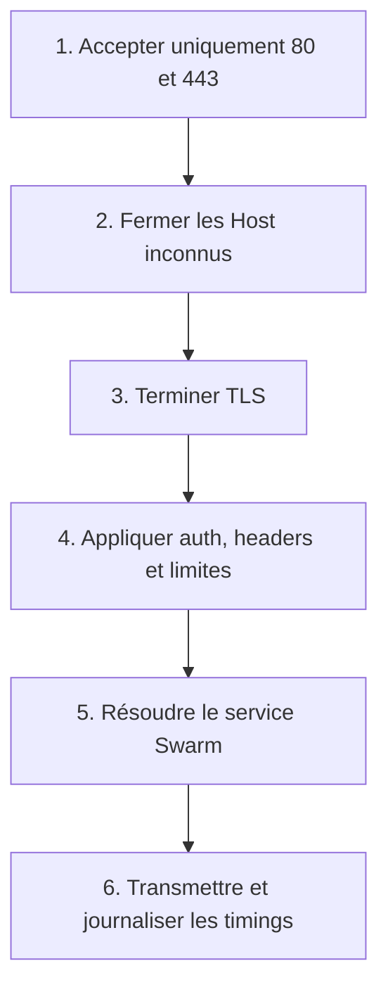
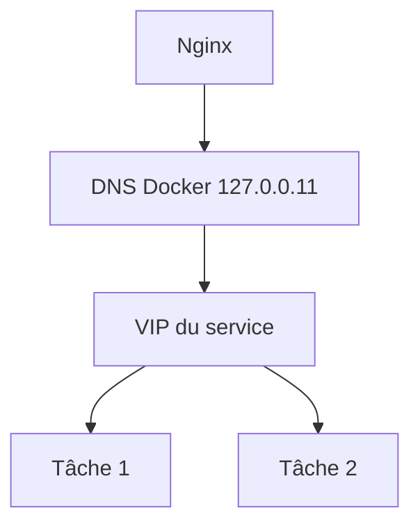
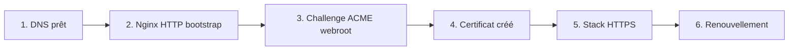
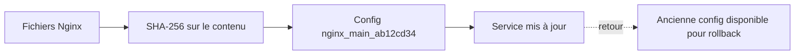

# Nginx, DNS Swarm et TLS

## Responsabilités de l'edge



Cette séquence donne l'ordre logique. Le reverse proxy est une **frontière de politique**, pas seulement un redirecteur.

## Pourquoi répondre 444 aux hôtes inconnus

Configuration dangereuse :

```nginx
server {
    listen 80 default_server;
    return 301 https://$host$request_uri;
}
```

Le client contrôle `$host`. Le serveur peut donc réfléchir une valeur arbitraire dans `Location`.

Configuration sûre :

```nginx
server {
    listen 80 default_server;
    server_name _;
    return 444;
}

server {
    listen 80;
    server_name glpi.example.com jenkins.example.com;

    location ^~ /.well-known/acme-challenge/ {
        root /var/www/certbot;
        try_files $uri =404;
    }

    location / {
        return 301 https://$host$request_uri;
    }
}
```

Seuls les Host connus sont redirigés. `444` est un code interne Nginx qui ferme la connexion.

## DNS interne Docker



Configuration :

```nginx
resolver 127.0.0.11 valid=30s ipv6=off;

location / {
    set $upstream "http://glpi_glpi:80";
    include /etc/nginx/snippets/proxy-common.conf;
    proxy_pass $upstream;
}
```

Pourquoi une variable ? Nginx résout le nom au runtime et peut le renouveler selon la durée configurée.

Nuance importante : une nouvelle tâche derrière un VIP Swarm ne change pas forcément l'adresse du service. Le resolver runtime devient surtout utile si le service est recréé, si DNSRR est utilisé ou si une ancienne résolution devient invalide.

## TLS : résoudre le problème de bootstrap



Pourquoi deux stacks ? Le serveur HTTPS référence un certificat. Au premier déploiement, ce fichier n'existe pas encore. Le bootstrap sert le challenge en HTTP sans exiger le certificat.

Un certificat SAN unique simplifie le cycle, mais couple tous les domaines :

- une modification réémet le certificat ;
- la liste de domaines est visible dans les SAN ;
- un échec peut affecter toute la liste.

## Docker Configs versionnées



Idée : une Docker Config est immuable. On crée un nouveau nom à chaque contenu au lieu de prétendre modifier l'objet existant.

Phrase forte :

> « L'empreinte transforme la configuration en artefact adressable : je peux relier un fichier validé à l'objet réellement déployé. »

## Ce que valide le pipeline

1. Syntaxe des scripts Bash.
2. Parité exacte entre liste ACME et `server_name`.
3. Absence de tags `latest`.
4. Rendu des deux stacks.
5. `nginx -t` dans l'image Nginx épinglée.

Ce qu'il ne valide pas hors cluster : DNS public, routage overlay réel, identifiants applicatifs et performance.

