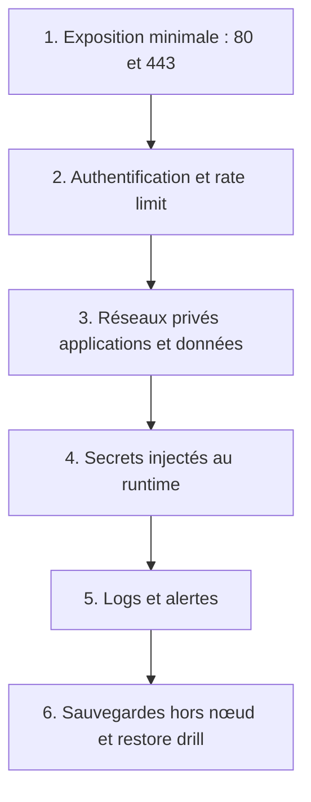
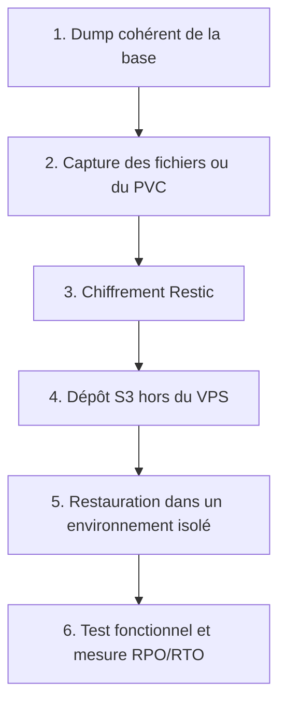

# Sécurité, secrets, sauvegarde et reprise

## Défense en profondeur

Aucune couche n'annule le besoin des suivantes.

## Moindre privilège

Le moindre privilège signifie : donner à un processus uniquement les accès nécessaires, pendant la durée nécessaire.

Applications concrètes :

- Nginx n'a pas besoin du socket Docker.
- Une base n'a pas besoin d'un port public.
- Un pod ne nécessitant pas l'API Kubernetes n'a pas besoin d'un token de ServiceAccount.
- Alloy a besoin de lire les métadonnées et logs des pods, mais pas de modifier des Deployments.
- Portainer ne reçoit pas automatiquement un rôle d'administrateur du cluster.

## Comparaison des secrets

| Mécanisme | Point fort | Limite |
|---|---|---|
| `.env` | Simple | Peut apparaître dans l'inspection du service et fuit facilement. |
| Docker Secret | Distribué seulement aux tâches autorisées | L'application doit lire le fichier ; le manager reste critique. |
| Kubernetes Secret | API standard | Base64 n'est pas du chiffrement ; RBAC et chiffrement au repos nécessaires. |
| SOPS + Age | Secret chiffré compatible avec Git | La clé Age et le plaintext local doivent être protégés. |

Formulation correcte :

> « J'ai réduit l'exposition des secrets, mais je conserve comme dette la migration des stacks historiques encore fondées sur `.env`. »

## Sauvegarde complète

### Pourquoi un volume n'est pas une sauvegarde

Le volume survit au remplacement du conteneur. Il ne survit pas forcément à :

- la perte du VPS ;
- la panne du disque ;
- une suppression ou corruption logique ;
- un rançongiciel ayant les mêmes droits ;
- une erreur d'application écrivant des données invalides.

### Dépendances à restaurer ensemble

| Application | Ensemble minimal |
|---|---|
| WordPress | Dump MySQL/MariaDB + `wp-content` + configuration nécessaire. |
| GLPI | Dump MariaDB + `/var/glpi`. |
| Passbolt | Dump MariaDB + clés GPG + clés JWT. |
| Jenkins | `JENKINS_HOME` cohérent et secrets nécessaires. |
| Superset | Base de métadonnées + configuration/clé secrète. |

## RPO et RTO

- **RPO** : quantité maximale de données que l'on accepte de perdre. Exemple : RPO de 6 h.
- **RTO** : temps maximal visé pour retrouver un service utile. Exemple : RTO de 4 h.

La fréquence d'un backup définit un RPO théorique. Seul un restore drill permet de mesurer la récupération réelle.

Phrase forte :

> « La rétention protège l'historique ; l'externalisation protège contre la perte du nœud ; la restauration prouve l'utilité de la sauvegarde. »

## Risques à reconnaître devant le jury

- Nœud unique.
- Interfaces administratives encore accessibles par Internet selon le déploiement réel.
- Basic Auth utile, mais inférieure à un VPN ou un proxy d'identité.
- Secrets `.env` historiques.
- Images internes encore dépendantes d'une discipline de registre.
- RPO/RTO non contractuels tant que l'exercice réel n'est pas mesuré.

Reconnaître une limite précisément renforce la crédibilité. La masquer donne au jury un angle d'attaque.

