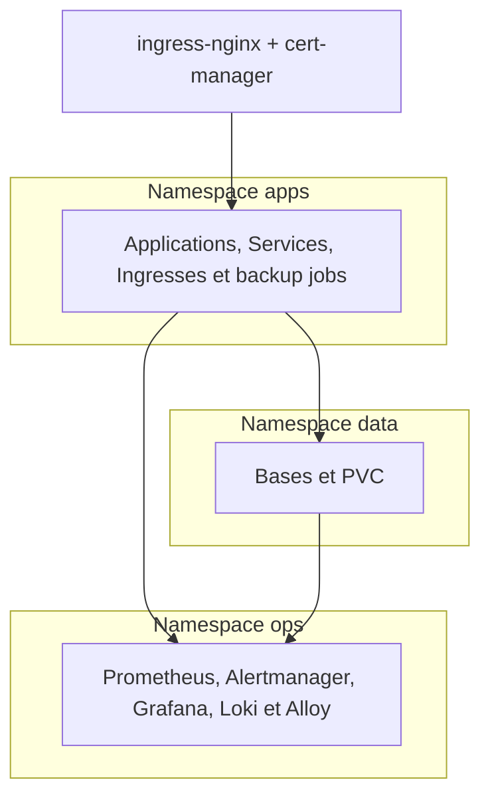
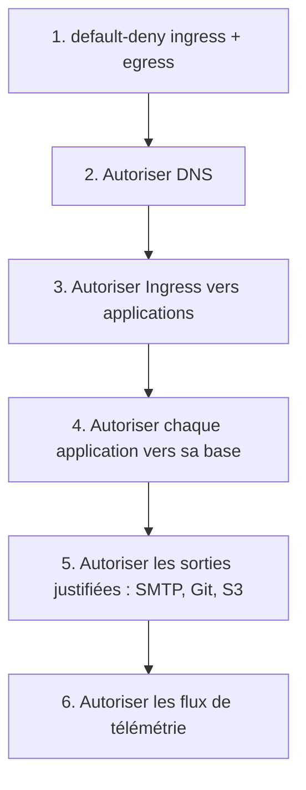
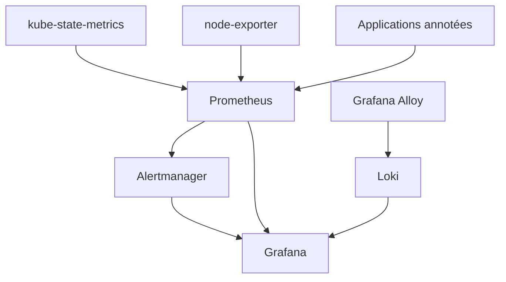

# K3s et observabilité

## Pourquoi K3s

K3s est une distribution Kubernetes légère. Sa valeur dans le projet : utiliser des APIs standard pour l'Ingress, les certificats, les policies, les identités, les quotas, les jobs et la télémétrie.

Ce n'est pas automatiquement :

- plus simple que Swarm ;
- hautement disponible sur un seul nœud ;
- sécurisé sans policies et RBAC ;
- prêt pour la production parce que `kubectl apply` réussit.

## Architecture par namespaces

Un namespace organise et limite certains objets. Il ne bloque pas les paquets réseau à lui seul.

## NetworkPolicies

Point important : le CNI doit réellement appliquer les NetworkPolicies. Il faut tester un flux autorisé et un flux interdit.

## Stockage

`local-path-retain` conserve un volume local après suppression du PVC, mais ne réplique pas les données vers un autre nœud.

Conséquence :

> « Le reclaim policy Retain réduit le risque de suppression accidentelle ; Restic traite le risque de perte du serveur. »

## Télémétrie

| Composant | Rôle | Ne pas confondre |
|---|---|---|
| Prometheus | Scrape et stocke des métriques temporelles. | Ce n'est pas le collecteur principal des logs. |
| Alertmanager | Groupe et route les alertes. | Une règle sans receiver testé ne garantit aucune notification. |
| Grafana | Interroge et visualise des sources. | Un dashboard n'est pas une preuve de reprise. |
| Loki | Indexe les labels et stocke les logs. | Ce n'est pas une base de métriques Prometheus. |
| Alloy | Découvre et collecte les logs des pods. | Il a besoin d'un RBAC en lecture, pas d'un rôle admin. |
| node-exporter | Expose les métriques de l'hôte. | Il faut sécuriser son exposition réseau. |

## Pourquoi Alloy remplace Promtail

Promtail est arrivé en fin de vie en mars 2026. Alloy est la trajectoire soutenue par Grafana. Le manifeste utilise la découverte Kubernetes par API, évitant un montage privilégié de `/var/log/pods`.

## Niveau de preuve du dépôt K3s

Validé :

- rendu `kubectl kustomize` ;
- règles de manifests ;
- absence d'images non épinglées ;
- résolution des 16 digests ;
- configuration Alloy avec le binaire épinglé ;
- garde-fous de valeurs production.

Pas encore prouvé dans un cluster réel :

- scheduling et probes ;
- application réelle des policies par le CNI ;
- Ingress et ACME publics ;
- capacité du stockage ;
- livraison d'alertes ;
- restauration et RPO/RTO ;
- comportement sous charge.

Réponse courte :

> « Le dépôt est production-oriented, mais son statut reste laboratoire tant que les preuves runtime et les restore drills ne sont pas obtenus. »

