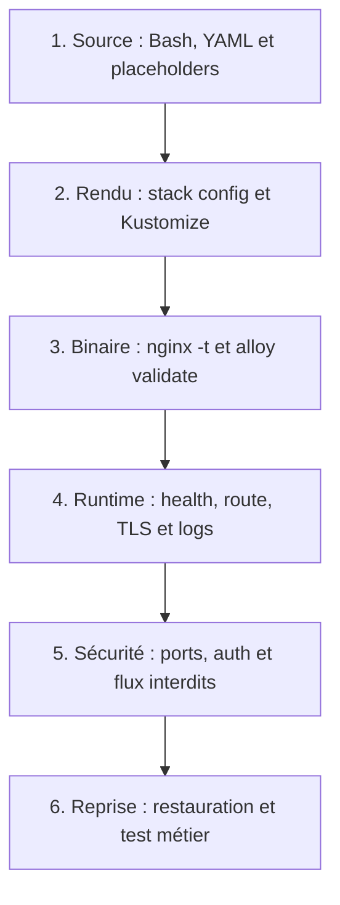
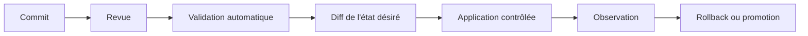

# Validation, changement et GitOps

## Pyramide de preuve



Plus on descend, plus le test est proche du service réel. Les premiers niveaux sont rapides et reproductibles ; les derniers fournissent une preuve plus forte mais nécessitent un environnement.

## Ce que signifie GitOps ici

GitOps ne signifie pas « mettre du YAML sur GitHub ».

Le cycle attendu :



Contrats :

- Git contient l'état désiré et l'historique.
- La CI bloque les erreurs déterministes.
- Le diff est lu avant mutation.
- Le changement possède un critère d'acceptation.
- Le rollback est préparé avant la fenêtre.

## Idempotence

Une opération idempotente peut être relancée et converge vers le même état sans exiger une suppression préalable.

Mauvais patron :

```bash
docker stack rm application
sleep 30
docker stack deploy -c stack.yml application
```

Problèmes : interruption forcée, attente arbitraire, perte de preuves et risque si le deuxième appel échoue.

Meilleur patron :

```bash
docker stack config -c stack.yml >/dev/null
docker stack deploy --prune -c stack.yml application
docker stack services application
```

## Immutabilité et déterminisme

- **Immutabilité** : l'artefact validé n'est pas modifié en place.
- **Déterminisme** : les mêmes entrées produisent le même état attendu.
- **Digest** : identifie précisément une image.
- **Empreinte de config** : identifie précisément un ensemble de fichiers.

Nuance : un digest ne corrige pas les CVE. Il empêche la dérive silencieuse et facilite le rollback.

## Checklist de changement

Avant :

1. bon contexte ;
2. backup frais ;
3. version précédente connue ;
4. validations vertes ;
5. capacité suffisante ;
6. critères de rollback écrits.

Après :

1. convergence des replicas ;
2. healthchecks ;
3. test d'un service public, admin et stateful ;
4. certificat et en-têtes ;
5. 5xx et latence ;
6. vérification différée après la fenêtre.

Phrase forte :

> « J'automatise les contrôles déterministes et je garde les décisions risquées derrière une revue explicite. »

