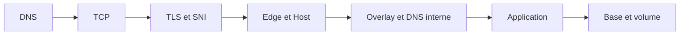

# Commandes à comprendre pour la démonstration

Le but n'est pas de mémoriser chaque option. Il faut expliquer **quelle hypothèse la commande teste**.

## DNS et TLS

```bash
dig +short glpi.example.com A
```

Question testée : vers quelle IPv4 le domaine pointe-t-il ?

```bash
openssl s_client \
  -connect glpi.example.com:443 \
  -servername glpi.example.com </dev/null
```

Question testée : quel certificat le serveur présente-t-il pour ce SNI ? Vérifier chaîne, SAN et dates.

```bash
curl --resolve glpi.example.com:443:203.0.113.10 \
  -I https://glpi.example.com/
```

Question testée : le nouvel edge répond-il correctement avant de modifier le DNS ? `--resolve` conserve le Host et le SNI mais force l'adresse.

## Swarm

```bash
docker stack services nginx-edge
docker service ps --no-trunc nginx-edge_nginx
docker service logs --since 15m nginx-edge_nginx
```

Lecture :

- `stack services` compare replicas désirés et actifs ;
- `service ps` montre l'historique de scheduling et les erreurs ;
- `service logs` donne le comportement applicatif horodaté.

```bash
docker stack config -c nginx.stack.yml
```

Question testée : après interpolation des variables, le manifeste Swarm est-il valide et conforme à ce que l'on pense déployer ?

## Validation Nginx

```bash
./deploy.sh validate
```

Cette commande doit être expliquée comme un pipeline : Bash, domaines, tags, rendu, certificat temporaire, puis `nginx -t` dans l'image exacte.

```bash
nginx -t
```

Cette commande valide la syntaxe et les fichiers référencés. Elle ne teste pas l'accessibilité réelle des upstreams.

## Ports

```bash
ss -lntup
```

Question testée : quels processus écoutent réellement sur l'hôte ?

```bash
nmap -Pn -p 22,80,443,3306,3307,27017,9000,9443 203.0.113.10
```

Question testée depuis une autre machine : quels ports sont réellement accessibles par le chemin externe ? Les bases doivent être fermées.

## K3s

```bash
kubectl kustomize . > /tmp/platform-rendered.yaml
```

Rend tous les manifests sans modifier le cluster.

```bash
kubectl diff -k .
```

Compare l'état désiré avec le cluster. Toujours vérifier le contexte avant :

```bash
kubectl config current-context
```

```bash
kubectl get pods -A -o wide
kubectl get events -A --sort-by=.lastTimestamp
```

Le premier donne l'état actuel ; le second aide à reconstruire une chronologie.

```bash
kubectl auth can-i list secrets \
  --as=system:serviceaccount:ops:alloy \
  -n apps
```

Question testée : l'identité Alloy possède-t-elle un droit qu'elle ne devrait pas avoir ? La réponse attendue est `no`.

## Backup

```bash
kubectl -n apps create job \
  --from=cronjob/backup-wordpress-db \
  backup-wordpress-db-manual
```

Crée une exécution immédiate à partir du CronJob. Ensuite :

```bash
kubectl -n apps logs -f job/backup-wordpress-db-manual
restic snapshots --tag wordpress-db
```

Un snapshot visible ne suffit pas. La preuve finale est une restauration sur une destination isolée et un test applicatif.

## Ordre de diagnostic à réciter



Phrase :

> « J'avance du client vers la donnée et je collecte une preuve à chaque frontière avant de modifier la suivante. »

